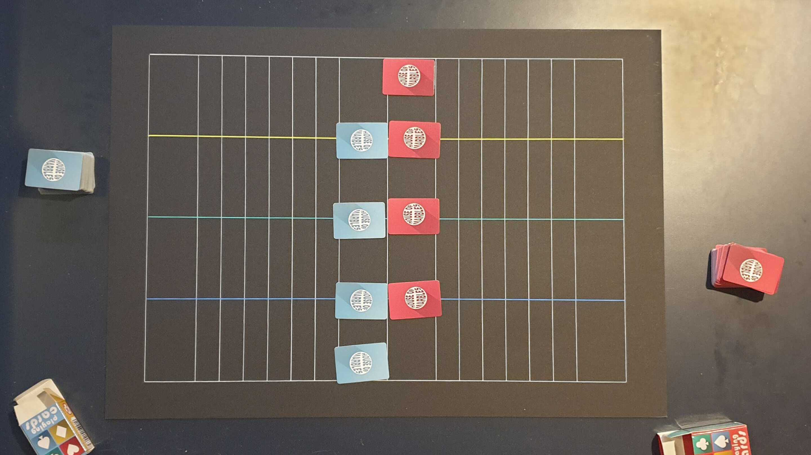
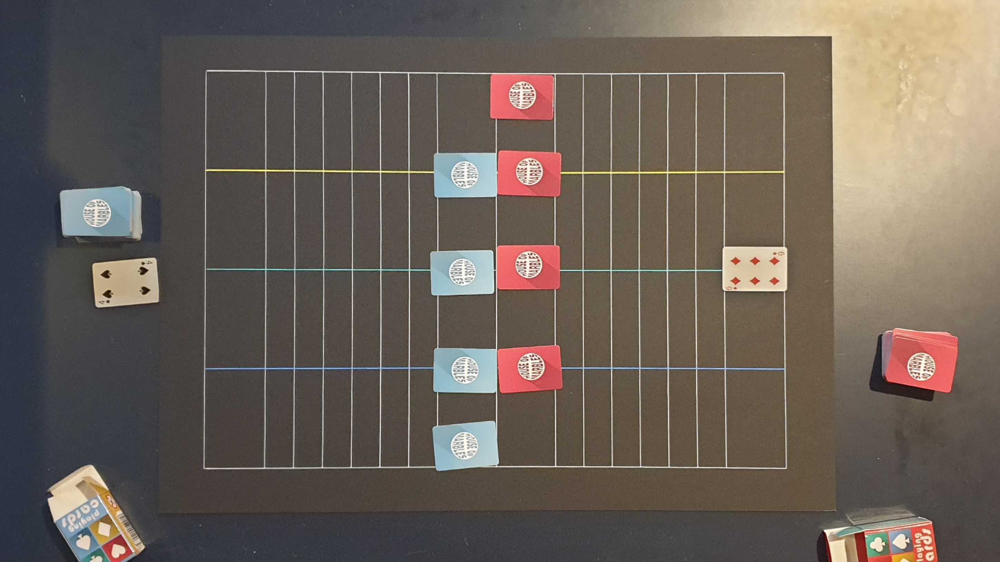
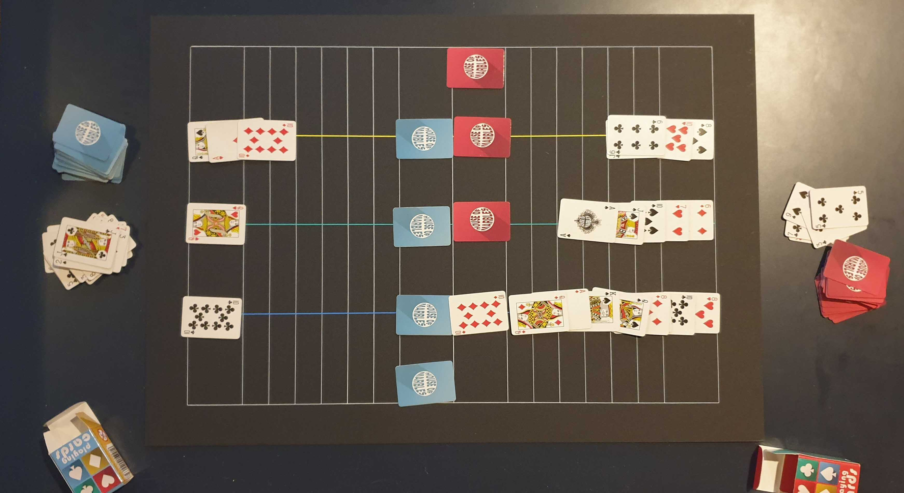

```{r setup, include=FALSE}
knitr::opts_chunk$set(echo = TRUE)
```

## Game Rules

1. Each player chooses a deck of 52 cards to play with (remove any jokers from the pack) and shuffles their deck.

2. Each player plays three cards face down, one on each of the coloured tracks, in the centre of the board and a fourth card (the “spare”) face down to the right of their cards (see Figure 1).

3. They put the rest of their deck down in front of them.

4. Each player turns over one card.

5. Whoever has the highest card places it at the start of any track (see Figure 2).

6. Keep turning over cards with the player with the highest card playing onto the board on any track following these rules:

   - If your card is higher than the last card that has been played on the chosen track, you can play your card a step closer to the centre of the board
   
   - If your card is not higher, then you place it directly on top of the last card that has been played on your chosen track
   
   - Ace is both high and low (can be played on anything and anything can play on top)
   
   - Ace wins a draw unless the other player draws a two
   
   - The first player to get their cards to the centre on any track wins that track and turns over their centre card (see Figure 3).
 
   - When all the tracks have been won, each player can choose to replace one of their winning track cards with their spare, without looking at its value, both players must declare whether they will play their spare before either player turns their card over
   
   - If they draw then the player with the least tracks wins.
   
     

## Scoring

* Ace = -1 points		
* Regular numbers = 1 point		
* Pictures = 2 points






